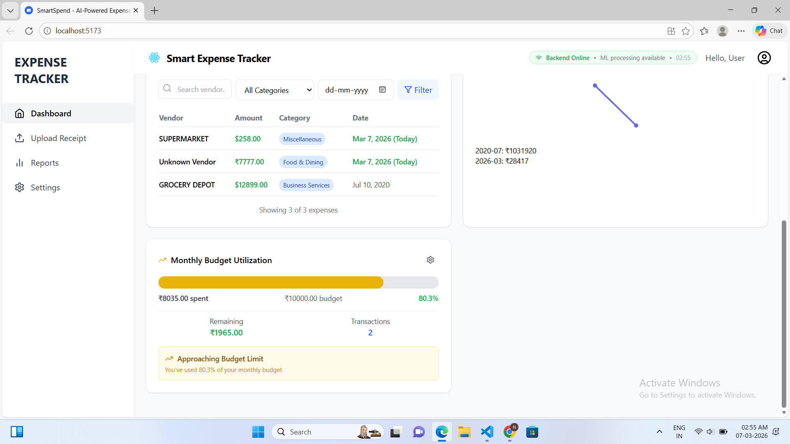
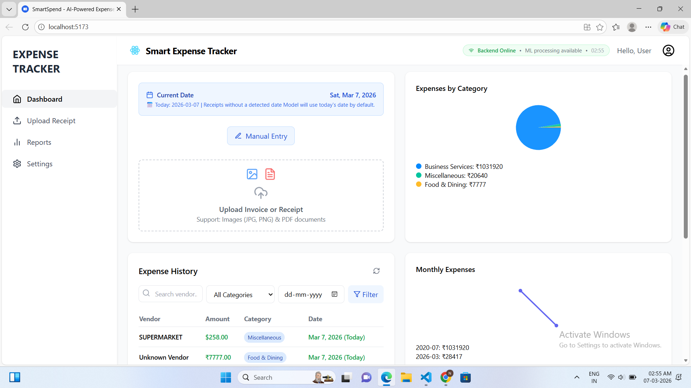
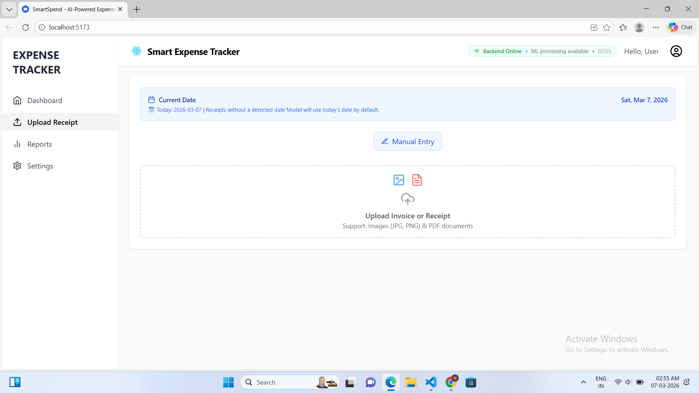
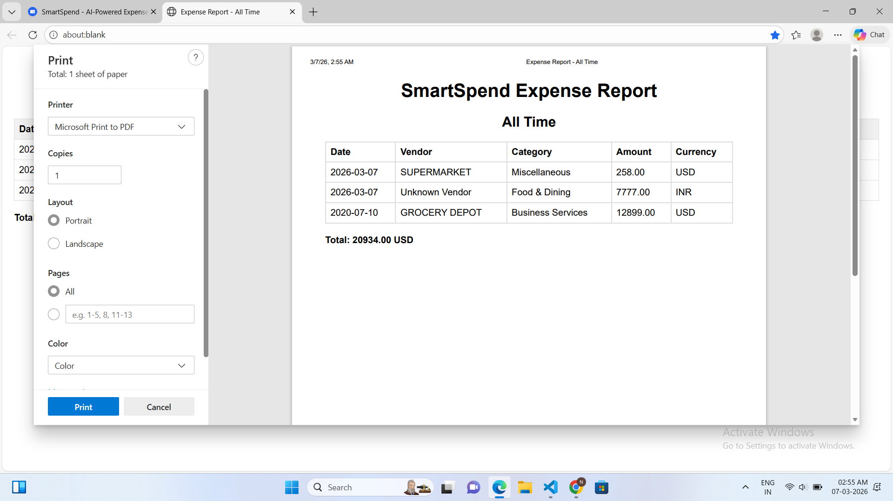
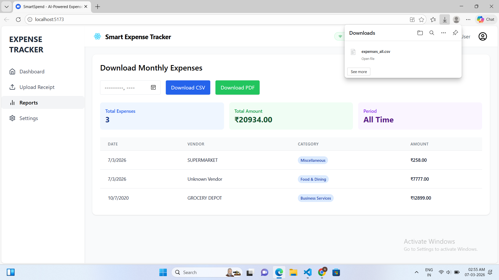

#  Smart Expense Tracker with ML-Powered Bill Extraction  

##  Project Overview  
This project is an **intelligent expense tracking system** that revolutionizes financial management through **Machine Learning and OCR technology**. Users can simply upload bill/receipt images, and the system automatically extracts all relevant information including amounts, vendors, dates, and line items, then intelligently categorizes expenses using a trained ML model.

The system provides a **comprehensive dashboard with insights, charts, and analytics** to help individuals and businesses make data-driven financial decisions.

##  Key Features  

### **ML-Powered Bill Extraction**
- **Advanced OCR Processing** – Extract text from any bill/receipt format
- **Smart Data Extraction** – Automatically identify amounts, vendors, dates, items
- **Intelligent Categorization** – ML model categorizes expenses with high accuracy
- **Multi-format Support** – Works with PNG, JPEG, TIFF, and other image formats

### **Intelligent Analytics**
- **Interactive Dashboard** – Real-time spending visualizations
- **Predictive Insights** – ML-driven spending pattern analysis  
- **Budget Tracking** – Smart alerts and recommendations
- **Custom Reports** – Export detailed reports in PDF/CSV formats

###  **Advanced Technology**
- **Real-time Processing** – Instant bill analysis and categorization
- **High Accuracy OCR** – Optimized image preprocessing for better text extraction
- **Scalable Architecture** – Handles multiple bill uploads efficiently
- **Error Handling** – Robust validation and fallback mechanisms


##  Tech Stack  

### **Frontend**
- React.js 18 with modern hooks
- Tailwind CSS for responsive design
- Framer Motion for smooth animations  
- Lucide React for beautiful icons
- Vite for fast development

### **Backend & ML**
- Flask with CORS support
- OpenCV for image preprocessing
- Tesseract OCR for text extraction
- scikit-learn for ML categorization
- NumPy & Pandas for data processing

### **Machine Learning Pipeline**
- **Text Processing**: TF-IDF vectorization for bill descriptions
- **Feature Engineering**: Amount, date, vendor analysis
- **Classification**: Logistic Regression with hybrid features
- **Model Persistence**: Joblib for model serialization


##  Project Structure  
```yaml
SmartSpend/
├── frontend/                 # React application
│   ├── src/
│   │   ├── components/      # UI components
│   │   │   ├── Dashboard.jsx
│   │   │   ├── UploadCard.jsx  # ML bill upload
│   │   │   ├── ExpenseTable.jsx
│   │   │   └── ...
│   │   ├── App.jsx
│   │   └── main.jsx
│   ├── package.json
│   └── vite.config.js
│
├── backend/                  # Flask API server
│   ├── app.py               # Main ML API application
│   ├── test_extraction.py   # Testing utilities
│   └── requirements.txt     # Python dependencies
│
├── Expense_model/           # ML model training
│   ├── Expense_Categorization_Model.ipynb
│   ├── expense_model.pkl    # Trained ML model
│   └── exp.csv             # Training dataset
│
├── ML_SETUP.md             # Detailed setup guide
├── setup.bat               # Windows setup script
└── requirements.txt        # Project dependencies
```


##  Quick Setup  

###  **Automated Setup (Windows)**
```bash
# Run the setup script
setup.bat
```

###  **Manual Setup**

#### 1️ **Install Tesseract OCR**
- **Windows**: Download from [Tesseract GitHub](https://github.com/UB-Mannheim/tesseract/wiki)
- **macOS**: `brew install tesseract`
- **Linux**: `sudo apt-get install tesseract-ocr`

#### 2️ **Backend Setup**
```bash
cd backend
pip install -r requirements.txt
python app.py  # Starts on http://localhost:5000
```

#### 3️ **Frontend Setup**
```bash
cd frontend
npm install
npm start  # Starts on http://localhost:5173
```

#### 4️ **Test the System**
```bash
cd backend
python test_extraction.py
```
## Screenshots

### Dashboard


### ML Bill Extraction


### Bill Upload & OCR Processing


### Expense List


### Report Download (CSV / PDF)



##  **How It Works**

### 1. **Upload Bill Image**
- Drag & drop or click to upload bill/receipt
- Supports all common image formats
- Real-time upload progress

### 2. **ML Processing Pipeline**
```
Image → OCR Preprocessing → Text Extraction → 
Data Parsing → ML Categorization → Results Display
```

### 3. **Intelligent Extraction**
- **Vendor Detection**: Identifies merchant/store name
- **Amount Recognition**: Finds total and line item amounts
- **Date Extraction**: Parses transaction dates
- **Item Analysis**: Lists individual purchased items
- **Smart Categorization**: ML model assigns expense category

### 4. **Review & Save**
- Review extracted information
- Make manual corrections if needed
- Add to expense database with one click


##  **ML Model Details**

### **Training Features**
- **Text Features**: TF-IDF vectors from bill descriptions
- **Numeric Features**: Amount, day of week, month
- **Hybrid Pipeline**: Combines text and numeric processing

### **Model Performance**
- **Algorithm**: Logistic Regression with regularization
- **Feature Processing**: StandardScaler + TfidfVectorizer
- **Validation**: Cross-validation with 80/20 split
- **Categories**: Food, Transportation, Utilities, Shopping, etc.

### **Continuous Learning**
- Model can be retrained with new data
- User corrections improve future predictions
- Regular model updates for better accuracy


##  **API Documentation**

### **Endpoints**
- `POST /api/process-bill` - Upload and process bill images
- `POST /api/categorize-expense` - Categorize individual expenses  
- `GET /api/health` - System health check

### **Example Response**
```json
{
  "success": true,
  "vendor": "Walmart Supercenter",
  "total_amount": 45.67,
  "dates": ["2025-10-01"],
  "category": "Groceries",
  "items": ["Milk", "Bread", "Eggs"],
  "confidence": 0.89
}
```


##  **Advanced Features**

### **Image Preprocessing**
- Gaussian blur for noise reduction
- OTSU thresholding for optimal binarization
- Morphological operations for text clarity

### **Error Handling**
- Fallback mechanisms for poor image quality
- Manual correction interface
- Confidence scoring for predictions

### **Performance Optimization**
- Async processing for large images
- Caching for repeated requests
- Batch processing capabilities

---


